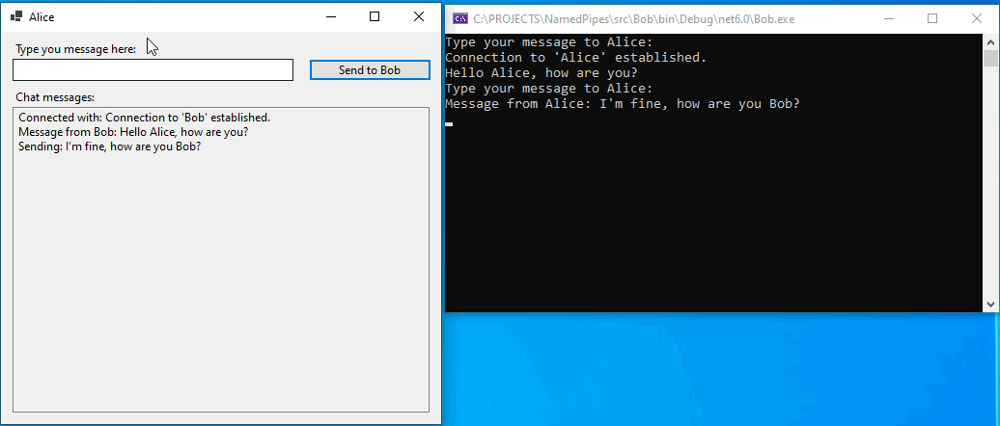
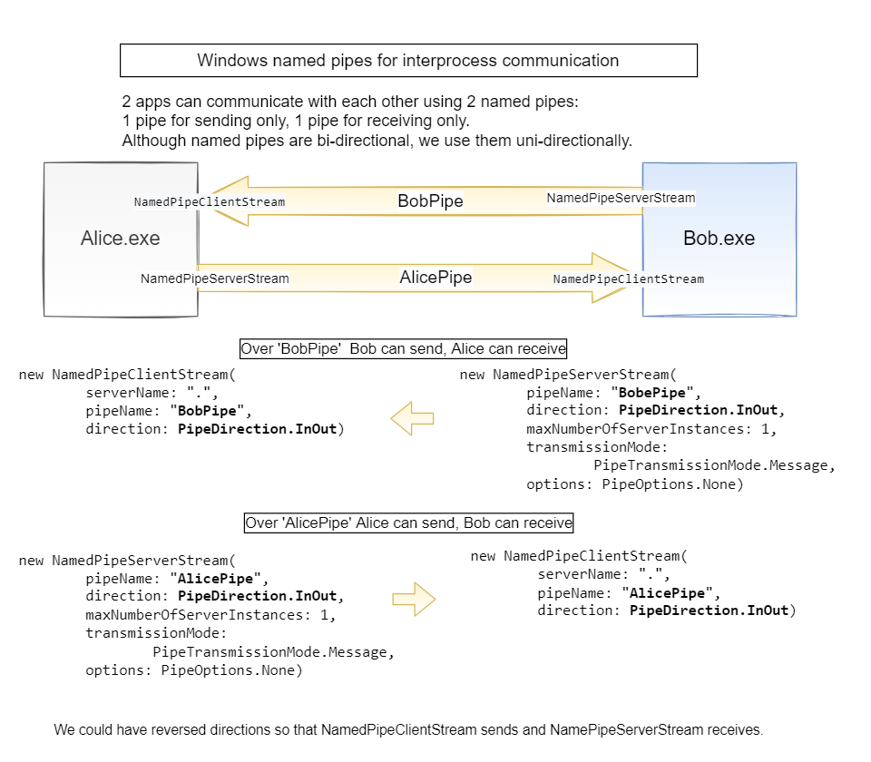

# Windows Named Pipes for Interprocess Communication

This is a .NET Core project demonstrating Windows named pipes.

Alice and Bob are two apps running on the same computer
which know nothing about each other, 
apart from partner's pipe name. 
They communicate with each other
over [named pipes](https://docs.microsoft.com/en-us/windows/win32/ipc/named-pipes). 
Each one can send and receive messages to/from the partner *at the same time*.





Note:
We could have reverses directions so that NamedPipeClientStream sends and NamePipeServerStream receives.

## SOURCE

Visual Studio(VS) solution consists of 3 projects:
- NamedPipeLib: library, core implementation based on named pipes.
- Alice: WinForms app, uses NamedPipeLib
- Bob: console app,  uses NamedPipeLib


## HOW TO BUILD

Open `/src/NamedPipes.sln` in VS and `Build Solution`.

## HOW TO USE

In VS, click on `Start without Debugging`. 
2 apps will appear: 
- Alice (desktop)
- Bob (console )

Type some text in one of the apps and see your message appear
instantly in the other app.

Try to restart one app; the connection should be established after restart.

If your try to start 2 Alice instances at the same time, 
you will see in the second Alice instance this error: 
```System.IO.IOException: All pipe instances are busy.```

